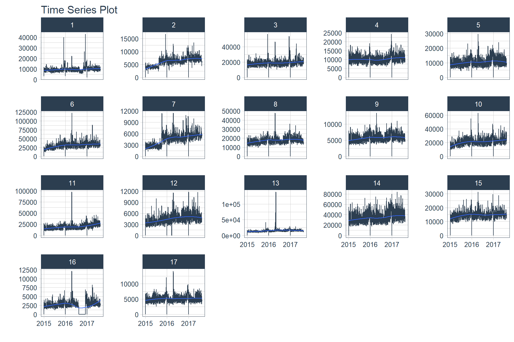
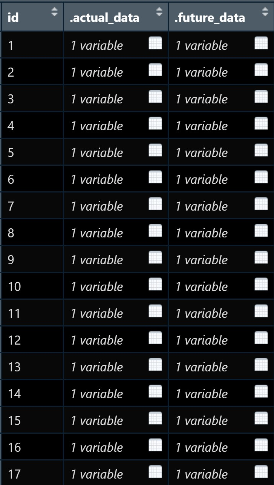
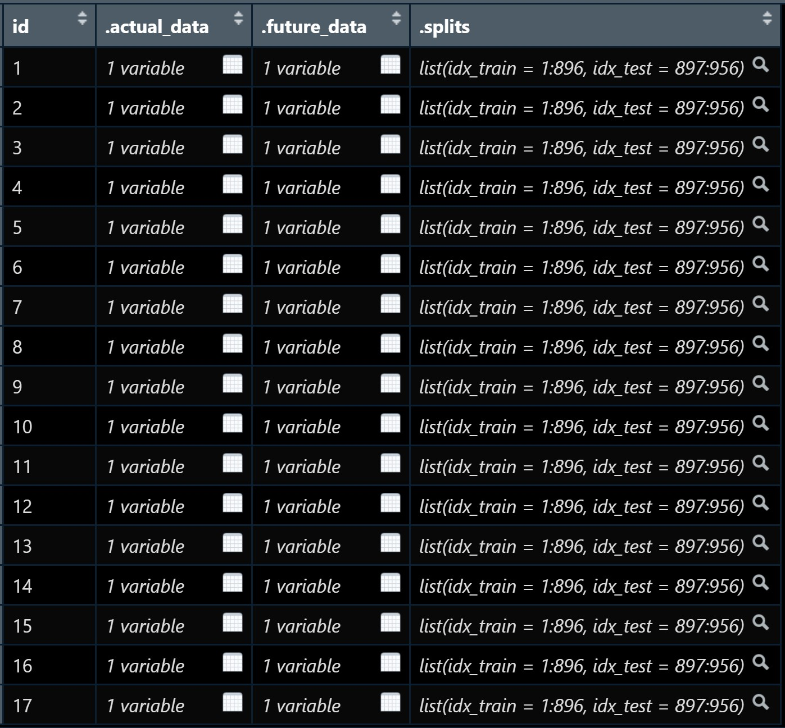
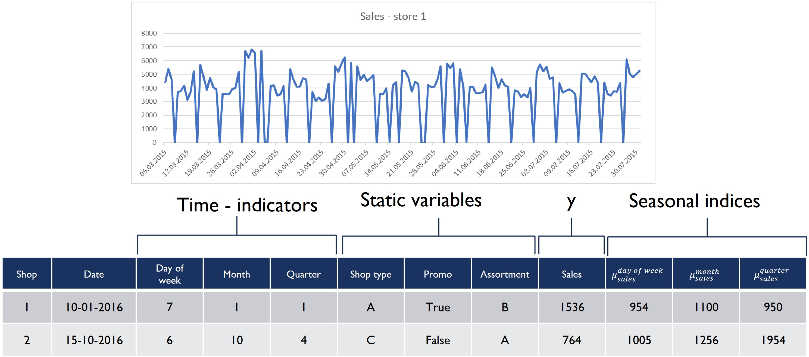
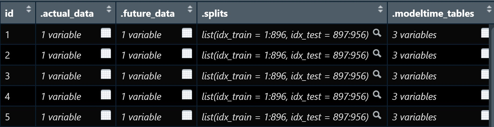
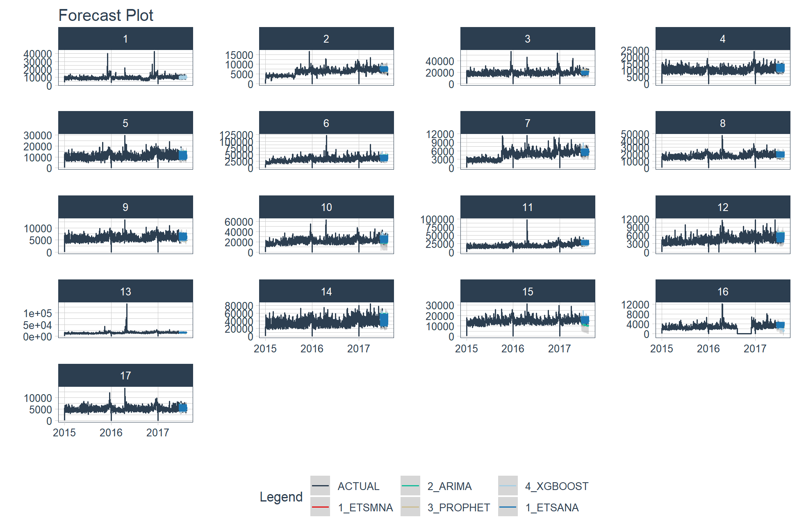
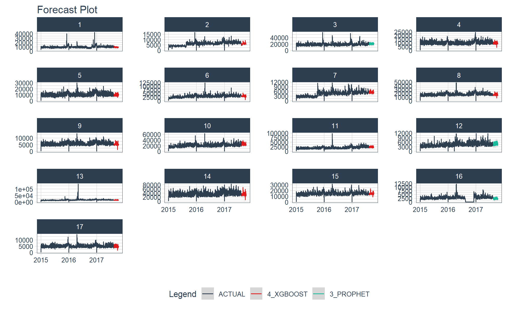

```{r setup, include=FALSE}
options(htmltools.dir.version = FALSE)
knitr::opts_chunk$set(fig.width=9, fig.height=3.5, fig.retina=3, out.width = "100%", cache = FALSE, echo = TRUE, eval = TRUE, message = FALSE,  warning = FALSE, hiline = TRUE)
```

```{r xaringan-themer, include=FALSE, warning=FALSE}
library(xaringanthemer)
style_duo_accent(
  primary_color = "#1381B0",
  secondary_color = "#FF961C",
  inverse_header_color = "#FFFFFF"
)
```

# Content

.vlarge[
+ The motivation 
+ Principles of nested forecasting approach
+ Nested forecasting processes
+ Nested forecasting with modeltime
]

---
## Motivation of Nested Forecasting Approach

.large[
In real world practice, it is very common a forecaster is required to forecast multiple time series by fitting multiple models.
]

.center[
]

---
class: center, middle

# Nested Forecasting


.small[
Source: [Getting Started with Modeltime](https://business-science.github.io/modeltime/articles/nested-forecasting.html)
]

---
## Setting Up R Environment

.pull-left[
For the purpose of this hands-on exercise, the following R packages will be used.

```{r}
pacman::p_load(tidyverse, tidymodels, 
               timetk, modeltime)
```

+ [**tidyverse**](https://lubridate.tidyverse.org/) provides a collection of commonly used functions for importing, wrangling and visualising data.  In this hands-on exercise the main packages used are readr, dplyr, tidyr and ggplot2.  
]

.pull-right[
+ [**modeltime**](https://business-science.github.io/modeltime/index.html) a new time series forecasting package designed to speed up model evaluation, selection, and forecasting. modeltime does this by integrating the [**tidymodels**](https://www.tidymodels.org/) machine learning ecosystem of packages into a streamlined workflow for tidyverse
forecasting. 
]

---
## The data

.pull-left[
In this sharing, [**Store Sales - Time Series Forecasting: Use machine learning to predict grocery sales**](https://www.kaggle.com/competitions/store-sales-time-series-forecasting/overview) from Kaggle competition will be used.  For the purpose of this sharing, the main data set used is *train.csv*.  It consists of six columns.  They are:

+ *id* contains unique id for each records.
+ *date* gives the sales dates.
+ *store_nbr* identifies the store at which the products are sold.
+ *family* identifies the type of product sold.
+ *sales* gives the total sales for a product family at a particular store at a given date. Fractional values are possible since products can be sold in fractional units (1.5 kg of cheese, for instance, as opposed to 1 bag of chips).
+ *onpromotion* gives the total number of items in a product family that were being promoted at a store at a given date.
]    

--
.pull-right[
For the purpose of this sharing, I will focus of grocery sales instead of all products.  Code chunk below is used to extract grocery sales from *train.csv* and saved the output into an rds file format for subsequent used.

```{r eval=FALSE}
grocery <- read_csv(
  "data/store_sales/train.csv") %>%
  filter(family == "GROCERY") %>%
  write_rds(
    "data/store_sales/grocery.rds")
```
]

---
### Step 1: Data Import and Wrangling

.pull-left[
In the code chunk below, `read_rds()` of **readr** package is used to import grocery.rds data into R environment. Then, `mutate()`, `across()` and `as.factor()` are used to convert all values in columns 1,3 and 4 into factor data type.

```{r}
grocery <- read_rds(
  "data/store_sales/grocery.rds") %>%
  mutate(across(c(1, 3, 4), 
                as.factor)) %>%
  filter(date >= "2015-01-01")
```
]

--
.pull-right[
In the code chunk below, `read_csv()` is used to import *stores.csv* file into R environment.  TThen, `mutate()`, `across()` and `as.factor()` are used to convert values in columns 1to 5 into factor data type.

```{r}
stores <- read_csv(
  "data/store_sales/stores.csv") %>%
  mutate(across(c(1:5), 
                as.factor)) %>%
  select(store_nbr, cluster)
```
]

---
### Data integration and wrangling

.pull-left[
In the code chunk below, `left_join()` of **dplyr** package is used to join *grocery* and *stores* tibble data frames by using *store_nb*r as unique field. 

```{r}
grocery_stores <- left_join(
  x = grocery,
  y = stores,
  by = "store_nbr")
```
]

--
.pull-right[
In the code chunk below, a new tibble data frame called *grocery_cluster* is derived by summing sales values by values in cluster and date fields.  

```{r}
grocery_cluster <- grocery_stores %>%
  group_by(cluster, date) %>%
  summarise(value = sum(sales)) %>%
  select(cluster, date, value) %>%
  set_names(c("id", "date", "value")) %>%
  ungroup()
```
]

---
### Visualising the time series data: The code chunk

.pull-left[
It is always a good practice to visualise the time series graphically.

```{r eval=FALSE}
grocery_cluster %>%
  group_by(id) %>%
  plot_time_series(
    date, value,
    .line_size = 0.4,
    .facet_ncol = 5, 
    .facet_scales = "free_y",
    .interactive = FALSE,
    .smooth_size = 0.4)
```
]

---
### Visualising the time series data: The plot 


---
## Preparation for Nested Forecasting

.pull-left[
Before fitting the nested forecasting models, there are two key components that we need to prepare for:

+ **Nested Data Structure:** Most critical to ensure your data is prepared (covered next).
+ **Nested Modeltime Workflow:** This stage is where we create many models, fit the models to the data, and generate forecasts at scale.
]

.pull-right[

]

---
### Step 2: Preparing Nested Time Series Data Frame

.pull-left[
.large[
There are three major steps in reparing the nested time series data frame.  They are:

+ Creating an initial data frame and extending to the future,

+ Transforming the tibble data frame into nested modeltime data frame, and 

+ Splitting the nested data frame into training and test (hold-out) data sets.
]]

---
### **Creating initial data frame and extending to the future**

.pull-left[
Firstly, we will create a new data table and extend the time frame 60 days into the future by using [`extend_timeseries()`](https://business-science.github.io/modeltime/reference/prep_nested.html) of modeltime.

```{r}
nested_tbl <- grocery_cluster %>%
  extend_timeseries(
    .id_var = id,
    .date_var = date,
    .length_future = "60 days") 
```
]

.pull-right[

]

---
### Nesting the tibble data frame
 
.pull-left[
Next, [`nest_timeseries()`](https://business-science.github.io/modeltime/reference/prep_nested.html) is used to transform the newly created data frame in previous slide into a  nested data frame by grouping the values in the *id* field.

```{r}
nested_tbl <- nested_tbl %>%
    nest_timeseries(
      .id_var        = id,
      .length_future = 60,
      .length_actual = 17272) 
```

Notice that the nested data frame consists of three fields namely *id*, *.actual_data* and *.future_data*.]

.pull-right[

]

---
### Data sampling

.pull-left[
Lastly, `split_nested_timeseries()` is used to split the original data into training and testing (or hold-out) data sets.

```{r}
nested_tbl <- nested_tbl %>%
  split_nested_timeseries(
    .length_test = 60)
```
]

.pull-right[

]

---
### Step 3: Creating Tidymodels Workflows

In this step, we will first applying tidymodels approach to create four forecasting models by using [`recipe()`](https://recipes.tidymodels.org/reference/recipe.html) of [**recipe**](https://recipes.tidymodels.org/) package and [`workflow()`](https://workflows.tidymodels.org/reference/workflow.html) of [**workflow**](https://workflows.tidymodels.org/) package. Both packages are member of [**tidymodels**](https://www.tidymodels.org/), a family of R packages specially designed for  modeling and machine learning using [**tidyverse**](https://www.tidyverse.org/) principles.  

.pull-left[
**Model 1: Exponential Smoothing (Modeltime)**

An Error-Trend-Season (ETS) model by using [`exp_smoothing()`](https://business-science.github.io/modeltime/reference/exp_smoothing.html).

```{r}
rec_autoETS <- recipe(
  value ~ date, 
  extract_nested_train_split(
    nested_tbl)) 

wflw_autoETS <- workflow() %>%
  add_model(
    exp_smoothing() %>% 
      set_engine("ets")) %>%
  add_recipe(rec_autoETS)
```
]

--
.pull-right[
**Model 2: Auto ARIMA (Modeltime)**

An auto ARIMA model by using [`arima_reg()`](https://business-science.github.io/modeltime/reference/arima_reg.html).

```{r}
rec_autoARIMA <- recipe(
  value ~ date, 
  extract_nested_train_split(
    nested_tbl)) 

wflw_autoARIMA <- workflow() %>%
  add_model(
    arima_reg() %>% 
      set_engine("auto_arima")) %>%
  add_recipe(rec_autoARIMA)
```
]

---
### Step 3: Creating Tidymodels Workflows (cont')
.pull-left[

**Model 3: Boosted Auto ARIMA (Modeltime)**

An Boosted auto ARIMA model by using [`arima_boost()`](https://business-science.github.io/modeltime/reference/arima_boost.html). 

```{r}
rec_xgb <- recipe(
  value ~ .,
  extract_nested_train_split(
    nested_tbl)) %>%
  step_timeseries_signature(date) %>%
  step_rm(date) %>%
  step_zv(all_predictors()) %>%
  step_dummy(all_nominal_predictors(), 
             one_hot = TRUE)

wflw_xgb <- workflow() %>%
  add_model(
    boost_tree(
      "regression") %>% 
      set_engine("xgboost")) %>%
  add_recipe(rec_xgb)

```
]

--
.pull-right[
**Model 4: prophet (Modeltime)**

A prophet model using [`prophet_reg()`](https://business-science.github.io/modeltime/reference/prophet_reg.html).

```{r}
rec_prophet <- recipe(
  value ~ date, 
  extract_nested_train_split(
    nested_tbl)) 

wflw_prophet <- workflow() %>%
  add_model(
    prophet_reg(
      "regression", 
      seasonality_yearly = TRUE) %>%
      set_engine("prophet")
    ) %>%
  add_recipe(rec_prophet)
```
]

---
### Prophet

[**Prophet**](https://facebook.github.io/prophet/) is a procedure for forecasting time series data based on an additive model where non-linear trends are fit with yearly, weekly, and daily seasonality, plus holiday effects. The general formula is defined as follow:


It works best with time series that have strong seasonal effects and several seasons of historical data. Prophet is robust to missing data and shifts in the trend, and typically handles outliers well.

.small[
Source: [Forecasting at Scale](https://peerj.com/preprints/3190/)
]

---
### XGBoost forecasting algorithm

**XGBoost(Extreme Gradient Boosting)** is an implementation of the gradient boosting ensemble algorithm for classification and regression. Time series datasets can be transformed into supervised learning using a sliding-window representation. 


.small[
Reference: [XGBOOST AS A TIME-SERIES
FORECASTING TOOL](https://filip-wojcik.com/talks/xgboost_forecasting_eng.pdf)
]

---
### What is so special of XGBoost?



---
## Nested Forecasting with modeltime

.center[
]

---
### Step 4: Fitting Nested Forecasting Models

.pull-left[
In this step, [`modeltime_nested_fit()`](https://business-science.github.io/modeltime/reference/modeltime_nested_fit.html) is used to fit the four models we created in Step 3.  Note that the input must be in the form of nested modeltime table (i.e. *nested_tbl*) 

```{r}
nested_tbl <- modeltime_nested_fit(
  nested_data = nested_tbl,
  wflw_autoETS,
  wflw_autoARIMA,
  wflw_prophet,
  wflw_xgb)
```
]

---
### The nested modeltime data frame

The output object *nested_tbl* is a nested modetime data frame.  



--

Click on the table icon of the first row under *.modeltime_tables* field, its corresponding modelling data frame appears.


Notice that the four models were fitted by using the test data set.

---
### Step 5: Model Accuracy Assessment with Test Logged Attributes

.pull-left[
Before we go ahead to select the best model, it is a good practice to compare the performance of the models by using accuracy matrices.  

```{r eval=FALSE}
nested_tbl %>%
  extract_nested_test_accuracy() %>%
  table_modeltime_accuracy(
    .interactive = FALSE)
```

What can we learn fro mthe code chunk above?

+ [`extract_nested_test_accuracy()`](https://business-science.github.io/modeltime/reference/log_extractors.html) is used to extract the accuracy matrices by using the test data set.

+ [`table_modeltime_accuracy()`](https://business-science.github.io/modeltime/reference/table_modeltime_accuracy.html) is used to display the accuracy report in tabular form.
]

.pull-right[
Note that `.interactive` argument returns interactive or static tables. If TRUE, returns `reactable` table. If FALSE, returns static `gt` table.
]

---
### Step 5: Model Accuracy Assessment with Test Logged Attributes

```{r echo=FALSE}
nested_tbl %>%
  extract_nested_test_accuracy() %>%
  table_modeltime_accuracy(
    .interactive = FALSE)
```

---
### Step 6: Extracting and Visualising Nested Test Forecast

.pull-left[
In this step, [`extract_nested_test_forecast()`](https://business-science.github.io/modeltime/reference/log_extractors.html) is used to extract the forecasted values from the nested modeltime data frame and [`plot_modeltime_forecast()`](https://business-science.github.io/modeltime/reference/plot_modeltime_forecast.html) is used to plot the forecasted values graphically.

```{r eval=FALSE}
nested_tbl %>%
  extract_nested_test_forecast() %>%
  group_by(id) %>%
  plot_modeltime_forecast(
    .facet_ncol = 4,
    .interactive = FALSE)
```
]

---
### Static multiple small line graphs



---
### Step 7: Extracting nested error logs

.pull-left[
Before going ahead to choose the best model, it is always a good practice to examine if there is any error in the model.  This task can be accomplished by using [`extract_nested_error_report()`](https://business-science.github.io/modeltime/reference/log_extractors.html).   

```{r}
nested_tbl %>%
  extract_nested_error_report()
```
]

---
### Step 8: Selecting the Best Model

.pull-left[
Now we are ready to select the best model by using [`modeltime_nested_select_best()`](https://business-science.github.io/modeltime/reference/modeltime_nested_select_best.html).

```{r}
best_nested_tbl <- nested_tbl %>%
  modeltime_nested_select_best(
    metric = "rmse",
    minimize = TRUE,
    filter_test_forecasts = TRUE)
```

Note that to select the best forecasting models, the `minimize` argument must set to *TRUE*.
]

---
### Extracting and displaying nested best model report

.pull-left[
After selecting the best model for each time series, we can display the best model report by using [`extract_nested_best_model_report()`](https://business-science.github.io/modeltime/reference/log_extractors.html).

```{r eval=FALSE}
best_nested_tbl %>%
  extract_nested_best_model_report() %>%
  table_modeltime_accuracy(
    .interactive = FALSE)
```
]

---
### Extracting and displaying nested best model report

```{r echo=FALSE}
best_nested_tbl %>%
  extract_nested_best_model_report() %>%
  table_modeltime_accuracy(
    .interactive = FALSE)
```

---
### Extracting and Visualising Nested Best Test Forecasts

.pull-left[
We can also plot multiple small line graphs by using `plot_modeltime_forecast()`.

```{r eval=FALSE}
best_nested_tbl %>%
  extract_nested_test_forecast() %>%
  group_by(id) %>%
  plot_modeltime_forecast(
    .facet_ncol = 4,
    .interactive = FALSE)
```
]

---
### Extracting and Visualising Nested Best Test Forecasts


---
### Step 9: Refitting and forecast forward

.pull-left[
The last step of the forecasting process is to refit the best models with the full data set and forecast to the future by using [`modeltime_nested_refit()`](https://business-science.github.io/modeltime/reference/modeltime_nested_refit.html). 

```{r}
nested_refit_tbl <- best_nested_tbl %>%
  modeltime_nested_refit(
    control = control_nested_refit(
      verbose = TRUE))
```

Note that `control_nested_refit(verbose = TRUE)` is used to display the modelling results as each model is refit. This is an useful way to follow the nested model fitting process.   
]

---
### Extracting and Visualising Nested Future Forecast

.pull-left[
Similar, `plot_modeltime_forecast()` can be used to visualise the forecasts.  However, instead of `extracted_nested_test_forecast()` is used, `extract_nested_future_forecast()` is used.

```{r eval=FALSE}
nested_refit_tbl %>%
  extract_nested_future_forecast() %>%
  group_by(id) %>%
  plot_modeltime_forecast(
    .interactive = FALSE,
    .facet_ncol = 4)
```
]

---
### Extracting and Visualising Nested Future Forecast



---
### Interactive Line Graph of Future Forecast

For effective data discovery, interactive data visualisation can be used as shown in the figure below.     

```{r echo=FALSE, fig.height=7}
nested_refit_tbl %>%
  extract_nested_future_forecast() %>%
  filter(id == 1) %>%
  plot_modeltime_forecast(
    .interactive = TRUE,
    .facet_ncol = 4,
    .plotly_slider = TRUE)
```

---
### Interactive Line Graph of Future Forecast

.pull-left[
Code chunk below is used to create the interactive line graph shown in previous slide.     

```{r eval=FALSE}
nested_refit_tbl %>%
  extract_nested_future_forecast() %>%
  filter(id == 1) %>%
  plot_modeltime_forecast(
    .interactive = TRUE,
    .facet_ncol = 4,
    .plotly_slider = TRUE)
```
]

```{r echo=FALSE, eval=FALSE}
library(pagedown)
pagedown::chrome_print("Topic4.html")
```