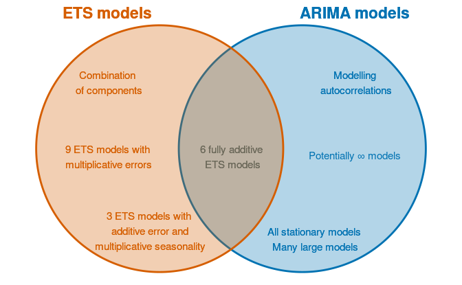
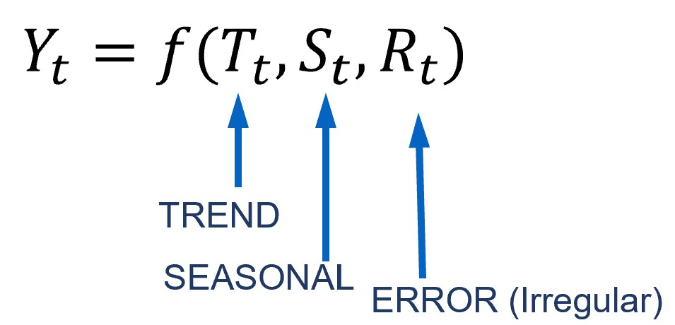
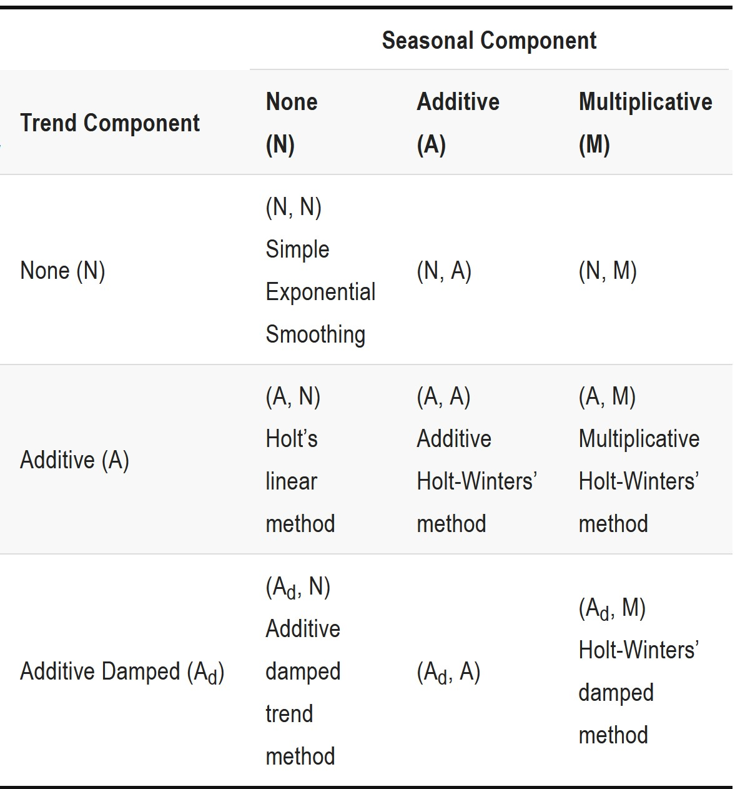
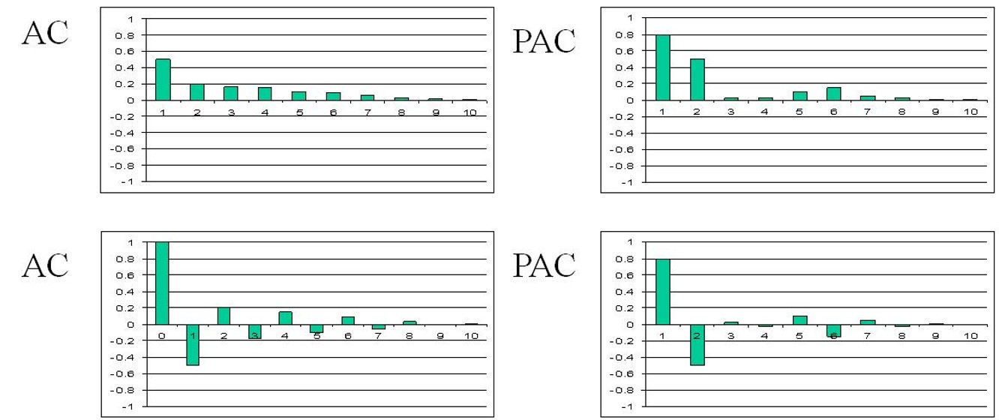
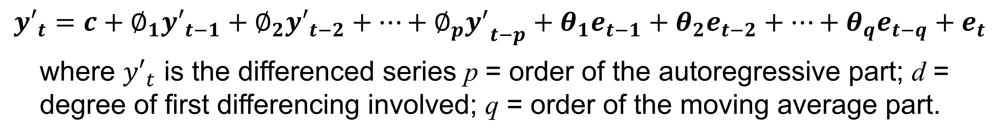
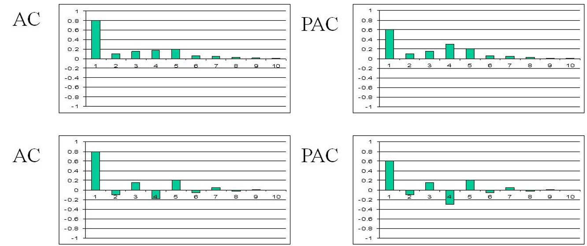
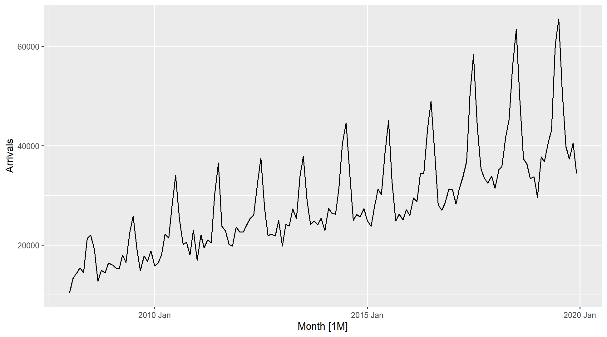
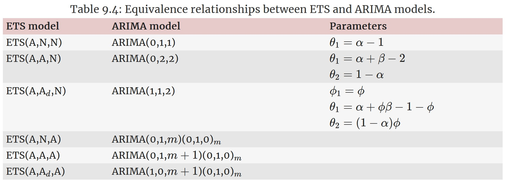
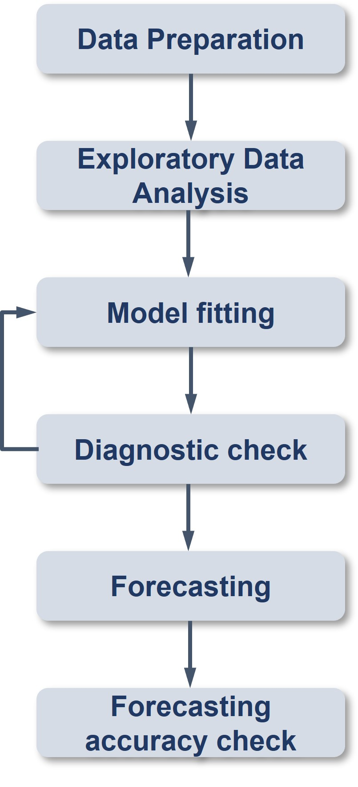

```{r setup, include=FALSE}
options(htmltools.dir.version = FALSE)
knitr::opts_chunk$set(fig.width=9, fig.height=3.5, fig.retina=3, out.width = "100%", cache = FALSE, echo = TRUE, eval = TRUE, message = FALSE,  warning = FALSE, hiline = TRUE)
```

```{r xaringan-themer, include=FALSE, warning=FALSE}
library(xaringanthemer)
style_duo_accent(
  primary_color = "#1381B0",
  secondary_color = "#FF961C",
  inverse_header_color = "#FFFFFF"
)
```

# Content

.large[
In this topic, you will learn the basic principles and methods of time series forecasting.

- Exponential Smoothing State Space Models (ETS)
- AutoRegressive Integrated Moving Average(ARIMA)
    - Stationary
    - Differencing
    
At the same time, you will gain hands-on experience on using:

- functions in **feasts** package to visualise, explore and detect time series patterns,
- functions in **fable** package fit time series forecasting model by using manual and automatic methods,
- functions in **fabletools** package to analyse the models including model comparison,
- functions in **fable** package to forecast the future values of the time series.
]

---
## Getting to Know the Time Series Forecasting Methods

+ Exponential Smoothing: Based on the based on a description of the *trend* and *seasonality* in the time series data. 
+ ARIMA: Based on the *autocorrelations* in the time series data.

.center[

]

.small[
Source: [*"9.10 ARIMA vs ETS"*](https://otexts.com/fpp3/arima-ets.html) of Rob J Hyndman and George Athanasopoulos (2022) **Forecasting: Principles and Practice** (3rd ed) (online version)]

---
class: center, middle

# Exponential Smoothing State Space Models (ETS) for Time Series Forecasting 

.center[

]
---
## Exponential Smoothing

.pull-left[
Exponential smoothing methods are weighted averages of past observations, with the weights decaying exponentially as the observations get more remote. Exponential smoothing is a family of methods that vary by their trend and seasonal components.

+ There can be no trend (N), an additive (A) linear trend from the forecast horizon, or a damped additive (Ad) trend leveling off from the forecast horizon. The trend could also be multiplicative (M) or multiplicative damped (Md), but Hyndman explains that they do not produced good forecasts.
+ There can be no seasonality (N), or it can be additive (A) change, or multiplicative (M) (proportional) change. Apparently seasonality does not have an additive damped version.
]

.pull-right[

]

---
### EDA methods for detecting trend, seasonality and errors: STL

.pull-left[

]

.pull-right[

]

---
class: center, middle

# AutoRegressive Integrated Moving Average(ARIMA) Methods for Time Series Forecasting 

---
## AutoRegressive Integrated Moving Average (ARIMA) models: An overview 

.pull-left[
ARIMA models are used to forecast the observation at (t+1) based on the historical data of previous time spots recorded for the same observation. 

The key aspects of ARIMA model are the following:

+ AR: Autoregression. This indicates that the time series is regressed on its own lagged values.
+ I: Integrated: This indicates that the data values have been replaced with the difference between their values and the previous values in order to convert the series into stationary.
+ MA: Moving Average. This indicates that the regression error is actually a linear combination of error terms whose values occurred contemporaneously and at various times in the past.
]

---
## ARIMA models: Basic Principles

.pull-left[
The ARIMA model can be applied when we have seasonal or non-seasonal data. The difference is that when we have seasonal data we need to add some more parameters to the model.


]

.pull-right[

For non-seasonal data the parameters are:

+ p: The number of lag observations the model will use
+ d: The number of times that the raw observations are differenced till stationarity.
+ q: The size of the moving average window.

For seasonal data we need to add also the following:

+ P: The number of seasonal lag observations the model will use
+ D: The number of times that the seasonal observations are differenced till stationarity.
+ Q: The size of the seasonal moving average window.
+ m: The number of observations of 1 season
]

---
### Autocorrelation Function (ACF) and Partial Autocorrelation Function (PACF)

.pull-left[
ACF and PACF plots are the two most used methods for choosing the best q and p values from them.


]

.pull-right[
The ACF plots the correlation coefficient against the lag, which is measured in terms of a number of periods or units. A lag corresponds to a certain point in time after which we observe the first value in the time series.

PACF is a statistical measure that captures the correlation between two variables after controlling for the effects of other variables. In short, a PACF captures a “direct” correlation between time series and a lagged version of itself.
]

---
### Autocorrelation Function (ACF) and Partial Autocorrelation Function (PACF)

.pull-left[
ACF and PACF plots are the two most used methods for choosing the best q and p values from them.


]

.pull-right[
+ When data have a trend, the autocorrelations for small lags tend to be large and positive because observations nearby in time are also nearby in value. So the ACF of a trended time series tends to have positive values that slowly decrease as the lags increase.
+ When data are seasonal, the autocorrelations will be larger for the seasonal lags (at multiples of the seasonal period) than for other lags.
+ When data are both trended and seasonal, you see a combination of these effects. The visitor from Vietnam data plotted on left shows both trend and seasonality. The slow decrease in the ACF as the lags increase is due to the trend, while the “scalloped” shape is due to the seasonality.
]

---
### AR Model Fit

.center[



]

+ When the autocorrelation coefficients gradually fall to 0, and the partial correlation has spikes, an AR model is appropriate. The order of the model depends on the number of spikes.
+ Figure above reveals an *AR(2)* model.

---
### MA Model Fit

.center[


]

+ When the partial correlation coefficients gradually fall to 0, and the autocorrelation has spikes, a MA model is appropriate. The order of the model depends on the number of spikes. 
+ Figure above shows a *MA(1)* model.
 
---
### ARIMA Model Fit

.center[



]

+ When both the autocorrelation and the partial correlograms show irregular patterns, then an ARIMA model is appropriate. The order of the model depends on the number of spikes.
+ Figure above reveals an *ARIMA(1,0,1)*.

---
## What is Stationary in Time Series?

.pull-left[
A **stationary** time series is one whose statistical properties do not depend on the time at which the series is observed. Thus, time series with trends, or with seasonality, are not stationary. On the other hand, a white noise series is stationary.  

Figure on the right shows that the monthly visitor arrivals from Vietnam by air are non-stationary.
]

.pull-right[



In general, it is necessary to make sure that the time series is stationary over the historical data of observation overtime period. If the time series is not stationary then we could apply the **differencing** factor on the records and see if the graph of the time series is a stationary overtime period.
]

---
## What is differencing?

.pull-left[
On way to make a time series non-stationary is to compute the differences between consecutive observations. This is known as **differencing**.  Differencing can help stabilise the mean of a time series by removing changes in the level of a time series, and therefore eliminating (or reducing) trend and seasonality.
]

---
### Differencing methods

.pull-left[
#### Trend differencing
.center[
]


]

--
.pull-right[
#### Seasonal differencing

.center[
]


]

The PACF is suggestive of an AR(1) model; so an initial candidate model is an ARIMA(1,1,0). The ACF suggests an MA(1) model; so an alternative candidate is an ARIMA(0,1,1).

---
### Where are the equivalence relationships between ETS and ARIMA models? 

.center[

]

.small[
Source: [*"9.10 ARIMA vs ETS"*](https://otexts.com/fpp3/arima-ets.html) of Rob J Hyndman and George Athanasopoulos (2022) **Forecasting: Principles and Practice** (3rd ed) (online version)]

---
## Setting Up R Environment

.pull-left[
For the purpose of this hands-on exercise, the following R packages will be used.

```{r}
pacman::p_load(tidyverse, lubridate, zoo, 
               seasonal, tsibble, feasts, 
               fable)
```

Two R packages are added in the list, they are:
+ [**fable**](https://lubridate.tidyverse.org/) provides a collection of commonly used univariate and multivariate time series forecasting models including exponential smoothing via state space models and automatic ARIMA modelling. It is a tidy version of the popular [**forecast**](https://cran.r-project.org/web/packages/forecast/index.html) package and a member of [**tidyverts**](https://tidyverts.org/).
]

.pull-right[
+ [**fabletools**](https://fabletools.tidyverts.org/index.html) provides tools for building modelling packages, with a focus on time series forecasting. This package allows package developers to extend fable with additional models, without needing to depend on the models supported by fable.  
]

---
## Importing the data

.pull-left[
For the purpose of this hands-on session, visitor arrivals data to Singapore between from Jan 2008 until Dec 2019 will be used.

+ *tsbl_longer*: Visitor arrivals data set in tsibble data frame format.  It is in rds format. 

In the code chunk below, `read_rds()` of **readr** package is used to import both data sets into R environment.

```{r}
tsbl_longer <- read_rds(
  "data/tsbl_longer.rds")
```
]

---
## Time Series Forecasting Processes

.center[

]

---
class: center, middle

# Time Series Forecasting: fable (tidyverts) methods


---
### Time Series Data Sampling

.pull-left[
In forecasting, we will split the time series into two parts.  The first part is called **estimate sample** (also known as training data).  It will be used to estimate the starting values and the smoothing parameters.  This sample typically contains 75-80 percent of the observation, although the forecaster may choose to use a smaller percentage for longer series.  
The second part of the time series is called **hold-out sample**.  It is used to check the forecasting performance.  No matter how many parameters are estimated with the estimation sample, each method under consideration can be evaluated with the use of the “new” observation contained in the hold-out sample.    
]

.pull-right[

]

---
## Step 1: Time Series Data Sampling

.pull-left[
A good practice in forecasting is to split the original data set into a training and a hold-out data sets. In this example we will use the last 12 months for hold-out and the rest for training.

First, an extra column called *Type* indicating training or hold-out will be created by using `mutate()` of **dplyr** package.  It will be extremely useful for subsequent data visualisation.

```{r}
vietnam_ts <- tsbl_longer %>%
  filter(Country == "Vietnam") %>% 
  mutate(Type = if_else(
    `Month-Year` >= "2019-01-01", 
    "Hold-out", "Training"))
```
]

--
.pull-right[
Next, a training data set is extracted from the original data set by using `filter()` of **dplyr** package.

```{r}
vietnam_train <- vietnam_ts %>%
  filter(`Month-Year` < "2019-01-01")
```
]

---
### Step 2: Exploratory Data Analysis (EDA): Time Series Data

Before fitting forecasting models, it is a good practice to analysis the time series data by using EDA methods.

.pull-left[
```{r fig.height=6}
vietnam_train %>%
  model(stl = STL(Arrivals)) %>%
  components() %>%
  autoplot()
```
]

--
.pull-right[
```{r fig.height=6}
tsbl_longer %>%
  filter(`Country` == "China") %>%
  model(stl = STL(Arrivals)) %>%
  components() %>%
  autoplot()
```
]

---
## Step 3: Fitting Exponential Smoothing State Space (ETS) Models: fable methods

.pull-left[
In fable, Exponential Smoothing State Space Models are supported by [`ETS()`](https://fable.tidyverts.org/reference/ETS.html). The combinations are specified through the formula:

```{r eval=FALSE}
ETS(y ~ error(c("A", "M")) 
    + trend(c("N", "A", "Ad")) 
    + season(c("N", "A", "M"))
```
]

---
### Fitting a simple exponential smoothing (SES)

.pull-left[
```{r}
fit_ses <- vietnam_train %>%
  model(ETS(Arrivals ~ error("A") 
            + trend("N") 
            + season("N")))
fit_ses
```
]

Notice that `model()` of fable package is used to estimate the ETS model on a particular dataset, and returns a **mable** (model table) object.

A mable contains a row for each time series (uniquely identified by the key variables), and a column for each model specification.  A model is contained within the cells of each model column.

---
### Examine Model Assumptions

.pull-left[
Next, `gg_tsresiduals()` of **feasts** package is used to check the model assumptions with residuals plots.

```{r fig.height=7}
gg_tsresiduals(fit_ses)
```
]

---
### The model details

.pull-left[
[`report()`](https://fabletools.tidyverts.org/reference/report.html) of fabletools is be used to reveal the model details.

```{r}
fit_ses %>%
  report()
```
]

---
### Fitting ETS Methods with Trend: Holt’s Linear

.pull-left[
#### Trend methods
```{r}
vietnam_H <- vietnam_train %>%
  model(`Holt's method` = 
          ETS(Arrivals ~ error("A") +
                trend("A") + 
                season("N")))
vietnam_H %>% report()
```
]

--
.pull-right[
#### Damped Trend methods
```{r}
vietnam_HAd <- vietnam_train %>%
  model(`Holt's method` = 
          ETS(Arrivals ~ error("A") +
                trend("Ad") + 
                season("N")))
vietnam_HAd %>% report()
```
]

---
### Checking for results

Check the model assumptions with residuals plots.

.pull-left[
```{r fig.height=7}
gg_tsresiduals(vietnam_H)
```
]

.pull-right[
```{r fig.height=7}
gg_tsresiduals(vietnam_HAd)
```
]

---
### Fitting ETS Methods with Season: Holt-Winters

```{r}
Vietnam_WH <- vietnam_train %>%
  model(
    Additive = ETS(Arrivals ~ error("A") 
                   + trend("A") 
                   + season("A")),
    Multiplicative = ETS(Arrivals ~ error("M") 
                         + trend("A") 
                         + season("M"))
    )

Vietnam_WH %>% report()
```

---
### Fitting multiple ETS Models

.pull-left[
```{r}
fit_ETS <- vietnam_train %>%
  model(`SES` = ETS(Arrivals ~ error("A") + 
                      trend("N") + 
                      season("N")),
        `Holt`= ETS(Arrivals ~ error("A") +
                      trend("A") +
                      season("N")),
        `damped Holt` = 
          ETS(Arrivals ~ error("A") +
                trend("Ad") + 
                season("N")),
        `WH_A` = ETS(
          Arrivals ~ error("A") + 
            trend("A") + 
            season("A")),
        `WH_M` = ETS(Arrivals ~ error("M") 
                         + trend("A") 
                         + season("M"))
  )

```
]

---
### The model coefficient

[`tidy()`]() of fabletools is be used to extract model coefficients from a mable.

```{r}
fit_ETS %>%
  tidy()
```

---
### Step 4: Model Comparison

`glance()` of fabletool

```{r}
fit_ETS %>% 
  report()
```

---
### Step 5: Forecasting future values

To forecast the future values, `forecast()` of fable will be used.  Notice that the forecast period is 12 months.

```{r fig.height=3}
fit_ETS %>%
  forecast(h = "12 months") %>%
  autoplot(vietnam_ts, 
           level = NULL)

```

---
### Fitting ETS Automatically

```{r}
fit_autoETS <- vietnam_train %>%
  model(ETS(Arrivals))
fit_autoETS %>% report()
```

---
### Fitting Fitting ETS Automatically

Next, we will check the model assumptions with residuals plots by using `gg_tsresiduals()` of **feasts** package

.pull-left[
```{r fig.height=7}
gg_tsresiduals(fit_autoETS)
```
]

---
### Forecast the future values

In the code chunk below, `forecast()` of **fable** package is used to forecast the future values. Then, `autoplot()` of **feasts** package is used to see the training data along with the forecast values.   

```{r fig.height=3}
fit_autoETS %>%
  forecast(h = "12 months") %>%
  autoplot(vietnam_train)
```

---
### Visualising AutoETS model with ggplot2

There are time that we are interested to visualise relationship between training data and fit data and forecasted values versus the hold-out data.

```{r echo=FALSE}
fc_autoETS <- fit_autoETS %>%
  forecast(h = "12 months")

vietnam_ts %>%
  ggplot(aes(x=`Month`, 
             y=Arrivals)) +
  autolayer(fc_autoETS, 
            alpha = 0.6) +
  geom_line(aes(
    color = Type), 
    alpha = 0.8) + 
  geom_line(aes(
    y = .mean, 
    colour = "Forecast"), 
    data = fc_autoETS) +
  geom_line(aes(
    y = .fitted, 
    colour = "Fitted"), 
    data = augment(fit_autoETS))
```

---
### Visualising AutoETS model with ggplot2

Code chunk below is used to create the data visualisation in previous slide.

```{r eval=FALSE}
fc_autoETS <- fit_autoETS %>%
  forecast(h = "12 months")

vietnam_ts %>%
  ggplot(aes(x=`Month`, 
             y=Arrivals)) +
  autolayer(fc_autoETS, 
            alpha = 0.6) +
  geom_line(aes(
    color = Type), 
    alpha = 0.8) + 
  geom_line(aes(
    y = .mean, 
    colour = "Forecast"), 
    data = fc_autoETS) +
  geom_line(aes(
    y = .fitted, 
    colour = "Fitted"), 
    data = augment(fit_autoETS))
```

---
class: center, middle

# AutoRegressive Integrated Moving Average(ARIMA) Methods for Time Series Forecasting: fable (tidyverts) methods 

---
### Visualising Autocorrelations: feasts methods

.pull-left[
**feasts** package provides a very handy function for visualising ACF and PACF of a time series called [`gg_tsdiaply()`](https://feasts.tidyverts.org/reference/gg_tsdisplay.html).


```{r fig.height=6}
vietnam_train %>%
  gg_tsdisplay(plot_type='partial')
```
]

---
### Visualising Autocorrelations: feasts methods

.pull-left[
```{r fig.height=6}
tsbl_longer %>%
  filter(`Country` == "Vietnam") %>%
  ACF(Arrivals) %>% 
  autoplot()
```
]

.pull-right[
```{r fig.height=6}
tsbl_longer %>%
  filter(`Country` == "United Kingdom") %>%
  ACF(Arrivals) %>% 
  autoplot()
```
]

By comparing both ACF plots, it is clear that visitor arrivals from United Kingdom were very seasonal and relatively weaker trend as compare to visitor arrivals from Vietnam.

---
### Differencing: fable methods

.pull-left[
#### Trend differencing

```{r}
tsbl_longer %>%
  filter(Country == "Vietnam") %>%
  gg_tsdisplay(difference(
    Arrivals,
    lag = 1), 
    plot_type='partial')
```
]

.pull-right[
#### Seasonal differencing

```{r}
tsbl_longer %>%
  filter(Country == "Vietnam") %>%
  gg_tsdisplay(difference(
    Arrivals,
    difference = 12), 
    plot_type='partial')
```
]

The PACF is suggestive of an AR(1) model; so an initial candidate model is an ARIMA(1,1,0). The ACF suggests an MA(1) model; so an alternative candidate is an ARIMA(0,1,1).

---
### Fitting ARIMA models manually: fable methods 

```{r}
fit_arima <- vietnam_train %>%
  model(
    arima200 = ARIMA(Arrivals ~ pdq(2,0,0)),
    sarima210 = ARIMA(Arrivals ~ pdq(2,0,0) + 
                        PDQ(2,1,0))
    )
report(fit_arima)
```

---
### Fitting ARIMA models automatically: fable methods

```{r}
fit_autoARIMA <- vietnam_train %>%
  model(ARIMA(Arrivals))
report(fit_autoARIMA)
```

---
### Model Comparison

```{r}
bind_rows(
    fit_autoARIMA %>% accuracy(),
    fit_autoETS %>% accuracy(),
    fit_autoARIMA %>% 
      forecast(h = 12) %>% 
      accuracy(vietnam_ts),
    fit_autoETS %>% 
      forecast(h = 12) %>% 
      accuracy(vietnam_ts)) %>%
  select(-ME, -MPE, -ACF1)
```

---
### Forecast Multiple Time Series

In this section, we will perform time series forecasting on multiple time series at one goal.  For the purpose of the hand-on exercise, visitor arrivals from five selected ASEAN countries will be used. 

.pull-left[
First, `filter()` is used to extract the selected countries' data.

```{r}
ASEAN <- tsbl_longer %>%
  filter(Country == "Vietnam" |
         Country == "Malaysia" |
         Country == "Indonesia" |
         Country == "Thailand" |
         Country == "Philippines")
```
]

--
.pull-right[
Next, `mutate()` is used to create a new field called Type and populates their respective values.  Lastly, `filter()` is used to extract the training data set and save it as a tsibble object called *ASEAN_train*. 

```{r}
ASEAN_train <- ASEAN %>%
  mutate(Type = if_else(
    `Month-Year` >= "2019-01-01", 
    "Hold-out", "Training")) %>%
  filter(Type == "Training")
```
]

---
### Fitting Mulltiple Time Series

In the code chunk below auto ETS and ARIMA models are fitted by using `model()`.

```{r}
ASEAN_fit <- ASEAN_train %>%
  model(
    ets = ETS(Arrivals),
    arima = ARIMA(Arrivals)
  )
```

---
### Examining Models

The `glance()` of **fabletools** provides a one-row summary of each model, and commonly includes descriptions of the model’s fit such as the residual variance and information criteria. 

```{r}
ASEAN_fit %>%
  glance()
```

**Be wary though**, as information criteria (AIC, AICc, BIC) are only comparable between the same model class and only if those models share the same response (after transformations and differencing).

---
### Extracintg fitted and residual values

The fitted values and residuals from a model can obtained using fitted() and residuals() respectively. Additionally, the augment() function may be more convenient, which provides the original data along with both fitted values and their residuals.

```{r}
ASEAN_fit %>%
  augment()
```

---
### Comparing Fit Models

In the code chunk below, `accuracy()` is used to compare the performances of the models.

```{r}
ASEAN_fit %>%
  accuracy() %>%
  arrange(Country)
```

---
### Forecast Future Values

Forecasts from these models can be produced directly as our specified models do not require any additional data.

```{r}
ASEAN_fc <- ASEAN_fit %>%
  forecast(h = "12 months")
```

---
### Visualising the forecasted values

In the code chunk below `autoplot()` of feasts package is used to plot the raw and fitted values.

```{r fig.height=3.5}
ASEAN_fc %>%
  autoplot(ASEAN)
```

```{r echo=FALSE, eval=FALSE}
library(pagedown)
pagedown::chrome_print("Topic2.html")
```
